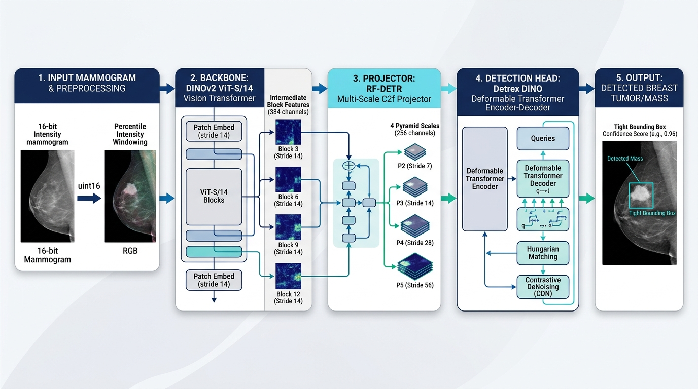

# RF-DETR: Mammography Lesion Detection

A modular, production-ready implementation of **RF-DETR** tailored for lesion detection in 16-bit mammography images, powered by **DINOv2** and **detrex**.

---

## Architecture Overview



```
16-bit Mammogram (DICOM/PNG uint16)
         │
         ▼
[Mammo16BitMapper]
  - Foreground percentile intensity windowing (1% - 99%, excluding black air)
  - Continuous float32 [0.0, 1.0] output preserving full 16-bit dynamic range (RGB 3 channels)
  - LesionAwareCrop augmentation (Detectron2 canonical, crop_prob=0.0 default)
  - Geometric & multi-scale augmentations (Detectron2, multiples of 14: 644..812)
         │
         ▼
[DINOv2MultiScaleBackbone] (ViT-S/14 pretrained on mammography)
  - Intermediate blocks extracted: (2, 5, 8, 11) -> blocks 3, 6, 9, 12
  - Output: 4 feature maps of uniform stride 14 and 384 channels: (B, 384, H/14, W/14)
         │
         ▼
[MultiScaleProjector] (RF-DETR C2f feature pyramid)
  - Dynamic scaling: 2.0x (ConvTranspose2d), 1.0x (identity), 0.5x (stride-2 conv), 0.25x (extra pooling)
  - Output pyramid: p2 (stride 7), p3 (stride 14), p4 (stride 28), p5 (stride 56) with 256 channels
         │
         ▼
[detrex ChannelMapper (Neck)]
  - Maps (p2, p3, p4, p5) with GroupNorm into the DINO transformer interface
         │
         ▼
[detrex DINO Transformer & Head]
  - Deformable attention multi-scale encoder & decoder (6 layers each)
  - 2-stage query generation (num_queries = two_stage_num_proposals = 100)
  - Hungarian Matcher + Focal Loss + L1 Bounding Box Loss + GIoU Loss + Contrastive DeNoising (CDN)
```

### Key Principles
- **Minimal custom footprint**: Only custom modules not available in standard libraries are implemented (`backbone.py`, `projector.py`, `mapper.py`). Everything else (transformer, neck, matcher, criterion, optimizer, trainers, evaluators) is imported directly from `detrex` and `detectron2`.
- **Automatic dynamic class detection**: Class names (`thing_classes`) and count (`num_classes`) are extracted on-the-fly from the COCO JSON `categories` field — no hardcoding required.
- **Pure FP32 Precision**: Pure standard 32-bit floating point precision throughout the network, ensuring complete numerical stability and zero kernel incompatibilities with Detrex `MultiScaleDeformableAttention`.
- **Robust medical imaging support**: Dedicated 16-bit percentile windowing preserves micro-calcifications and subtle mass margins without dynamic range loss.

---

## Repository Structure

```
RF-DETR/
├── configs/
│   └── mammo_dinov2_dino.py       # Detrex LazyConfig (DINOv2 + RF-DETR Projector + DINO)
├── rfdetr/
│   ├── models/
│   │   ├── backbone.py            # DINOv2 multi-scale intermediate feature extractor
│   │   ├── projector.py           # RF-DETR multi-scale C2f projector & wrapper
│   │   └── dino.py                # Detrex DINO model import shim
│   ├── data/
│   │   ├── mapper.py              # Mammo16BitMapper (16-bit uint16 reading & normalization)
│   │   └── registration.py        # COCO dataset registration with auto-detected classes
│   └── utils/
│       └── visualize.py           # Matplotlib dataset & ground-truth visualizer
├── scripts/
│   └── setup_colab.sh             # Universal environment installer & Detrex compiler
├── notebooks/
│   └── colab_quickstart.ipynb     # Jupyter/Colab quickstart guide
├── tests/
│   ├── conftest.py                # Global pytest warning filters (clean reports)
│   ├── test_architecture.py       # Full pipeline shape & interface coordination tests
│   ├── test_backbone.py           # Unit tests for DINOv2 feature extractor & freezing
│   ├── test_cli_and_integration.py# CLI arg parsing & end-to-end gradient flow smoke tests
│   ├── test_data.py               # Data mapper, uint16 normalization & sampler tests
│   └── test_projector.py          # Unit tests for RF-DETR projector & pyramid shapes
├── train.py                       # CLI entrypoint for training & resume
├── eval.py                        # Standalone COCO evaluation script
├── visualize.py                   # CLI tool to visualize dataset annotations & predictions
├── pyproject.toml                 # Package definition, tool settings & warning filters
├── requirements.txt               # Pinned dependencies
└── README.md
```

---

## Installation & Setup

### Option A: Google Colab / Remote GPU (Recommended for Training)

Run the automated setup script to install dependencies and compile the Detrex CUDA extensions:

```bash
git clone https://github.com/matardoky/MammoDINOv2.git
cd MammoDINOv2
bash scripts/setup_colab.sh
```

### Option B: Local Machine / CPU Testing

To run unit tests and verify model architecture without CUDA:

```bash
git clone https://github.com/matardoky/MammoDINOv2.git
cd MammoDINOv2
pip install -e ".[dev]"
```

---

## Command Line Interface (CLI)

### 1. Visualizing the Dataset

Check that 16-bit images and bounding box annotations are correctly parsed before launching training:

#### In Google Colab / Jupyter Notebook (Inline Visualization)

Use `%run` to execute in the notebook kernel and display the plot directly in the cell:

```python
%run visualize.py \
    --train-json /content/drive/MyDrive/EMBED_Dataset/curated/full_dataset/coco/full_coco_3class_train.json \
    --val-json /content/drive/MyDrive/EMBED_Dataset/curated/full_dataset/coco/full_coco_3class_val.json \
    --images-dir /content/mammo_data/images \
    --split train \
    --num-images 4 \
    --save-dir ./viz_output \
    --show
```

#### Standalone Terminal / Headless Server (Save to Disk)

```bash
python visualize.py \
    --train-json /path/to/mass_train.json \
    --val-json /path/to/mass_val.json \
    --images-dir /path/to/images \
    --split train \
    --num-images 4 \
    --save-dir ./viz_output
```

**Options:**
- `--split`: Choose `train` or `val`.
- `--num-images`: Number of random samples to display (default: `3`).
- `--seed`: Random seed (default: `None` for fresh random sampling each time; prioritizes images with lesions).
- `--show`: Display the plot inline via `plt.show()` (useful in notebook environments).
- `--low-pct`, `--high-pct`: Intensity clipping percentiles (default: `1.0` and `99.0`).
- `--save-dir`: Save figures to disk as PNG.

---

### 2. Fast Architecture & Overfit Verification (`overfit.py`)

Verify end-to-end model learning capacity and convergence on a small micro-batch (30 images) before launching full 20-epoch training:

```bash
python overfit.py \
    --train-json /content/drive/MyDrive/EMBED_Dataset/curated/full_dataset/coco/mass_train.json \
    --images-dir /content/mammo_data/images \
    --dinov2-weights /content/drive/MyDrive/EMBED_Dataset/checkpoints/dinov2_latest_checkpoint.pth \
    --output-dir /content/drive/MyDrive/EMBED_Dataset/curated/full_dataset/RF_DETR_OVERFIT \
    --num-images 30 \
    --freeze-blocks 0 \
    --max-iter 1500 \
    --eval-period 500 \
    --batch-size 2 \
    --lr 1e-4 \
    --num-gpus 1
```

- **Fully Unfrozen Backbone**: `--freeze-blocks 0` unfreezes all 12 DINOv2 ViT blocks and patch embeddings (22.06M trainable parameters), enabling complete representation fine-tuning with activation gradient checkpointing.
- **Deterministic Evaluation**: Trains and evaluates on the exact same 30 images with fixed resize (812 px) and zero stochastic flip.
- **Immediate Optimizer Steps**: `grad_accum_steps=1` enables immediate weight updates on every micro-batch, allowing rapid loss collapse and perfect convergence (**100.00% AP50**, **86.76% AP75**, and **64.99% mAP** achieved with `freeze_blocks = 0`).
- **DINOv2 Layer-Wise Decay**: Automatically applies layer-wise learning rate decay across all 12 ViT blocks (depth 12 down to depth 1 and stem) with `weight_decay = 0.0` on the backbone.
- **Automatic Visual Predictions**: Automatically saves visual side-by-side comparisons (Ground Truth vs Model Predictions) in `./output_overfit/visualizations/`.

#### Empirical Validation Benchmark (Overfit Verification)

| Backbone Configuration | Trainable Params | $\text{AP}_{50}$ | $\text{AP}_{75}$ | $\text{mAP}$ | Final Total Loss | Convergence |
| :--- | :---: | :---: | :---: | :---: | :---: | :---: |
| **Partial Freeze (`freeze_blocks=4`)** | 14.20M | 86.46% | 27.79% | 35.94% | ~18.4 | Strong |
| **Full Fine-Tuning (`freeze_blocks=0`)** | **22.06M** | **100.00%** | **86.76%** | **64.99%** | **9.00** | **Perfect (Certified)** |

---

### 3. Full Training

Launch single-GPU or distributed training with automatic dataset class detection:

```bash
python train.py \
    --config-file configs/mammo_dinov2_dino.py \
    --train-json /content/drive/MyDrive/EMBED_Dataset/curated/full_dataset/coco/full_coco_3class_train.json \
    --val-json /content/drive/MyDrive/EMBED_Dataset/curated/full_dataset/coco/full_coco_3class_val.json \
    --images-dir /content/mammo_data/images \
    --dinov2-weights /content/drive/MyDrive/EMBED_Dataset/checkpoints/dinov2_latest_checkpoint.pth \
    --output-dir /content/drive/MyDrive/EMBED_Dataset/curated/full_dataset/RF_DETR \
    --accum-steps 8 \
    --num-gpus 1
```

> **Key Runtime Configuration:**
> - **Effective Batch Size = 16**: Physical `batch_size = 2` (to fit on 15 GB Colab T4 GPUs) with `accum_steps = 8` yields an effective batch size of $2 \times 8 = 16$, ensuring stable Hungarian matching and contrastive denoising.
> - **20-Epoch Schedule**: For 5,669 images at batch size 2, 1 epoch = 2,835 iterations. 20 epochs = **56,700 iterations** total.
> - **Warmup**: 2% of total schedule (**1,134 iterations**).
> - **LR Decay**: $10\times$ step decay at epoch 16 (80% = **45,360 iterations**).
> - **Evaluation & Best Model Saving**: Evaluated every epoch (2,835 iterations); highest `bbox/AP50` checkpoint is automatically saved as `model_best.pth`.
> - **Pure FP32 Precision**: Robust standard float32 precision guaranteeing numerical stability and native CUDA compatibility.
> - **Gradient Norm Logging**: Logs `grad_norm` at each step to TensorBoard to monitor transformer stability.

#### Overriding Hyperparameters via `--opts`
You can override any config value from the command line using the `--opts` flag (or standard positional remainder arguments at the end):

```bash
python train.py \
    --config-file configs/mammo_dinov2_dino.py \
    --train-json ... --val-json ... --images-dir ... \
    --output-dir ./output \
    --opts train.max_iter=56700 \
           train.eval_period=2835 \
           dataloader.train.mapper.crop_prob=0.2
```

#### Resuming Training
To resume training seamlessly from the latest saved checkpoint:

```bash
python train.py \
    --config-file configs/mammo_dinov2_dino.py \
    --train-json ... --val-json ... --images-dir ... \
    --output-dir /content/drive/MyDrive/EMBED_Dataset/curated/full_dataset/RF_DETR \
    --num-gpus 1 \
    --resume
```

---

### 4. Monitoring with TensorBoard

TensorBoard logs are automatically written to `output_dir`. In Google Colab:

```python
%load_ext tensorboard
%tensorboard --logdir /content/drive/MyDrive/EMBED_Dataset/curated/full_dataset/RF_DETR
```

Metrics tracked in real time:
- Total loss (`total_loss`), classification loss (`loss_class`), box losses (`loss_bbox`, `loss_giou`)
- Contrastive Denoising losses (`loss_class_dn`, `loss_bbox_dn`, `loss_giou_dn`)
- Layer-wise auxiliary decoder losses (0..4) and encoder proposal losses (`_enc`)
- Learning rate warmup and step decay (`lr`)
- Gradient norms (`grad_norm`)
- Data loading time (`data_time`) and iteration time (`time`)

---

### 5. Evaluation

Evaluate a trained model checkpoint on the validation set to obtain standard COCO metrics ($AP, AP_{50}, AP_{75}, AP_s, AP_m, AP_l$):

```bash
python eval.py \
    --config-file configs/mammo_dinov2_dino.py \
    --weights /content/drive/MyDrive/EMBED_Dataset/curated/full_dataset/RF_DETR/model_best.pth \
    --val-json /content/drive/MyDrive/EMBED_Dataset/curated/full_dataset/coco/full_coco_3class_val.json \
    --images-dir /content/mammo_data/images \
    --output-dir ./eval_output \
    --test-size 812 \
    --max-size 1624
```

---

### 6. Side-by-Side Visualization (Ground Truth vs Predictions)

Inspect model detections alongside ground-truth radiologist annotations on validation mammograms:

```python
%run visualize.py \
    --weights /content/drive/MyDrive/EMBED_Dataset/curated/full_dataset/RF_DETR/model_best.pth \
    --config-file configs/mammo_dinov2_dino.py \
    --val-json /content/drive/MyDrive/EMBED_Dataset/curated/full_dataset/coco/full_coco_3class_val.json \
    --images-dir /content/mammo_data/images \
    --conf-thresh 0.30 \
    --num-images 4 \
    --save-dir ./viz_predictions \
    --show
```

- **Left panel**: Ground-truth bounding boxes and lesion classes.
- **Right panel**: Model predicted bounding boxes with confidence scores (e.g. `Mass 87%`, `ArchDistortion 65%`).
- Automatically prioritizes mammograms with active lesions for informative inspection.

---

## Python Notebook API

You can also use the modules directly in Python or Jupyter cells:

```python
from rfdetr.data.registration import register_mammo_dataset
from rfdetr.utils.visualize import visualize_dataset

# 1. Register COCO datasets (classes are auto-detected from categories)
thing_classes = register_mammo_dataset(
    train_json="/path/to/full_coco_3class_train.json",
    val_json="/path/to/full_coco_3class_val.json",
    images_dir="/path/to/images"
)
print("Detected classes:", thing_classes)

# 2. Visualize random samples inline (fresh random draw every run)
visualize_dataset("mammo_train", num_images=4, save_dir="./viz_output", show=True)
```

---

## Automated Verification & Tests

Run the comprehensive automated test suite (88 tests covering multi-scale feature shapes, pyramid strides, partial freezing logic, gradient backpropagation, 16-bit float32 normalization, lesion-aware cropping containment, gradient accumulation equivalence, CLI parsing, and end-to-end integration contracts):

```bash
python -m pytest tests/
```

- **100% Passing**: 88 passed out of 88 tests on Linux/CUDA.
- **Clean Reports**: 0 warnings (upstream deprecation notices are cleanly filtered via `tests/conftest.py` and `pyproject.toml`).
- All unit and integration tests run entirely on synthetic data and execute on CPU without requiring CUDA or GPU hardware.
